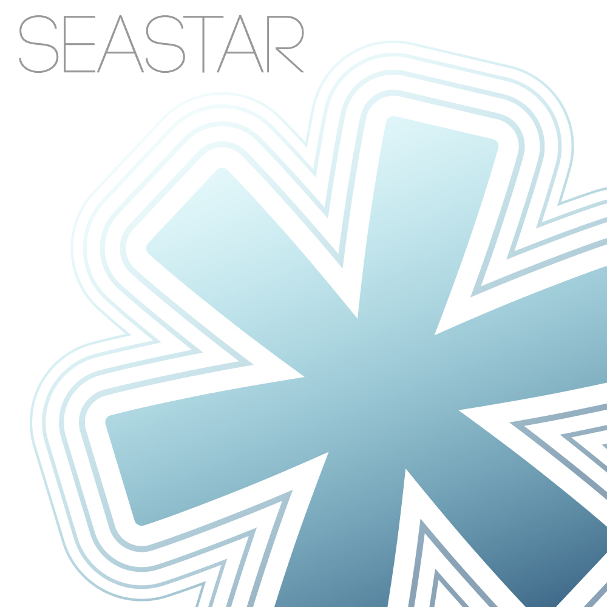

# SeastarNC

SeastarNC, formerly known as Beaver, is a library written for Rhino Common and Grasshopper for real-time 3d printer control.  

SeastarNC support real-time connection between Grasshopper and open-source 3D printing firmware.  
This project was made possible by the generous support of SPACE10 through a research residency program in summer 2019.  
A protoype was created by modifying an Anycubic Linear Plus Delta printer with additional 3 rotational axes.  

  
**Installation:**  
 * Go to SeastarNC/Beaver/bin and download Beaver.gha.  
 * Open Grasshopper and go to File/Special Folder/Library.
 * Place Beaver.gha into the Library folder.
SeastarNC is still an WIP and will be releases on Food4Rhino. Stay tune!  
  
**Features**  
 * enable the usage of 3D printers as robotic arm system.
 * supoort up to 6 axis Gcode and some error checks.
 * connect to other functions within grasshopper. eg. Firefly sensors.
 * custom tool path planning for 3d printing and milling.
 * compute SPM axial input and offset correction.
  
**There are 6 main catergory of component:**  
 * Config:   Read ini file from slicer software and extract existing parameter.  
 * Machine:  Create machines objects with information of dimension and rotational axes configuration.  
 * Path:     Create path objects and provide means of manipulation. eg. join, insert.  	
 * File:     Save file for offline use.  
 * Control:  Real-time connection to 3d printer. Automatically queue and send command.  
 * Sim:      Visualization of tool path.  

Go to /TestDemo folder and try out some of the Demo. Test file are for WIP but you are welcome to take a look too.  
To run the Demo files, you'll need to install Firefly and ghowl.  
  
Use SeastarNC with Repetier6X(https://github.com/anthonychukh/Repetier6X) or other 6-axis firmware.  
  
This long-exposure stop motion was created with Seastar.

---
SeastarNC is released under MIT License.
---
**DISCLAIMER**  

This library and Grasshopper plugin was created out of the good intension of education and promotion of technology.  
User should take their own caution and risk when using this library.  
The creator(s) and contributors of this library do not provide any garantee or waranty to the use of this library and/or digital tool derives from this library.   
  

---
**CAUTION**  
  
Working with electronic devices could be dangerous.  
Always take precaution accordingly and make sure you are well trained and informed to work on the specific system.  
Failure to operate your machine correctly could result in hardware damage and/or serious injuries.  
